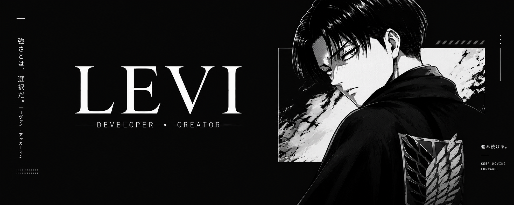

  

 

<h2 align="center">ABOUT ME</h2>

<h3 align="center">Hey there! I'm Levi.</h3>

  I'm a developer focused on turning ideas into code.
    
  I enjoy learning new technologies, experimenting with new projects and constantly improving the things I build.
    
  Most of my time is spent working with <b>Python, JavaScript, TypeScript and Lua</b>.
    
  When I'm not coding, I'm probably thinking about what to build next.

 

---

<h2 align="center">TECH STACK</h2>

  
  
  
  
  
  
  
  

 

---

<h2 align="center">CONNECT</h2>

  

 

> Code is never finished. It just gets better over time.

  LEVI • DEVELOPER & CREATOR

